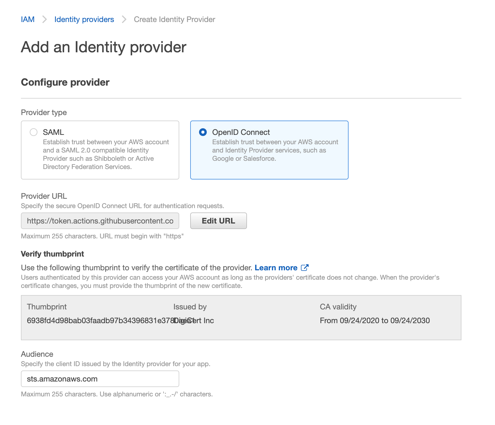
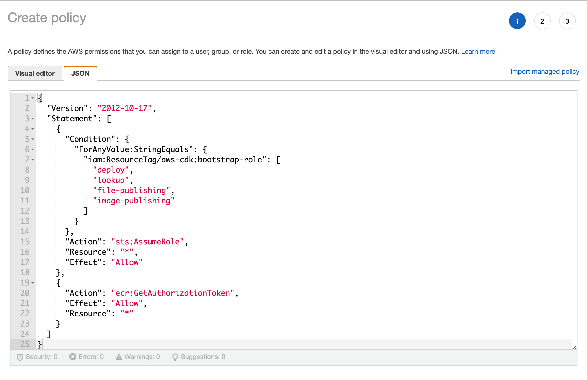
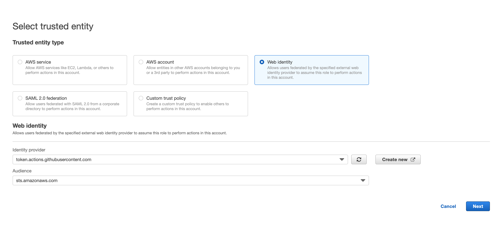
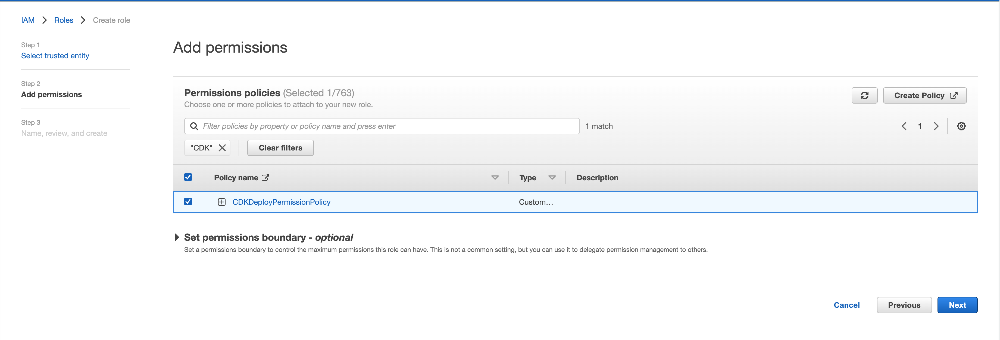

# Deployment goals
1. Cross-account deployment
2. Deploy from CI/CD
3. Manual approval

# Bootstrap
### 1. Bootstrap your primary aws account
```
AWS_PROFILE=cmdlab-sandpit1 npx cdk bootstrap --toolkit-stack-name gh-deploy --qualifier ghdep aws://[primary-account-id]/ap-southeast-2 --trust-for-lookup [second-account-id] --cloudformation-execution-policies arn:aws:iam::aws:policy/AdministratorAccess
```
### 2. Bootstrap your secondary aws account
```
AWS_PROFILE=cmdlab-sandpit2 npx cdk bootstrap --toolkit-stack-name gh-deploy --qualifier ghdep aws://[second-account-id]/ap-southeast-2 --trust [primary-account-id] --cloudformation-execution-policies arn:aws:iam::aws:policy/AdministratorAccess
```
### 3. Configure cdk.json
Add `"@aws-cdk/core:bootstrapQualifier": "ghdep",` in the context section. The `cdk.json` file tells the CDK Toolkit how to execute your app.

# Github OIDC Role
You only need to create the role in your primary AWS account.

### 1. Create Identity providers
see [github-oidc-for-aws](https://docs.github.com/en/actions/deployment/security-hardening-your-deployments/configuring-openid-connect-in-amazon-web-services) for more details.


### 2. Create IAM Policy `CDKDeployPermissionPolicy`
see [minimal policies required by cdk-pipelines-github](https://github.com/cdklabs/cdk-pipelines-github/blob/main/GITHUB_ACTION_ROLE_SETUP.md#manually-set-up-the-github-action-role) for more details

```
{
    "Version": "2012-10-17",
    "Statement": [
        {
            "Condition": {
                "ForAnyValue:StringEquals": {
                    "iam:ResourceTag/aws-cdk:bootstrap-role": [
                        "deploy",
                        "lookup",
                        "file-publishing",
                        "image-publishing"
                    ]
                }
            },
            "Action": "sts:AssumeRole",
            "Resource": "*",
            "Effect": "Allow"
        },
        {
            "Action": "ecr:GetAuthorizationToken",
            "Effect": "Allow",
            "Resource": "*"
        }
    ]
}
```

### 3. Create the `GitHubActionRole` role
Choose web identity

Attach the policy


### 4. Edit `GitHubActionRole` Role's trust policy 
```
{
    "Version": "2012-10-17",
    "Statement": [
        {
            "Effect": "Allow",
            "Principal": {
                "Federated": "arn:aws:iam::[primary-account-id]:oidc-provider/token.actions.githubusercontent.com"
            },
            "Action": "sts:AssumeRoleWithWebIdentity",
            "Condition": {
                "StringEquals": {
                    "token.actions.githubusercontent.com:aud": "sts.amazonaws.com"
                },
                "StringLike": {
                    "token.actions.githubusercontent.com:sub": [
                        "repo:liweiyi88/*:ref:refs/heads/*",
                        "repo:liweiyi88/*:environment:*"
                    ]
                }
            }
        }
    ]
}
```
